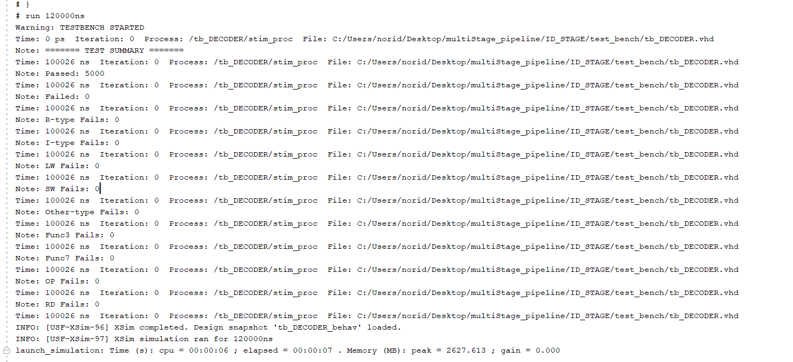
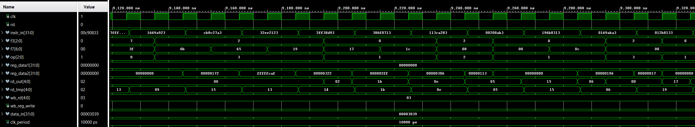

# ID_STAGE

## Overview
This module implements the Instruction Decode (ID) stage of a pipelined CPU. It handles instruction parsing, register file access, and generates control signals for downstream stages. Designed in VHDL for educational purposes.

## Features
- Decodes R-type, I-type, and load/store instructions.
- Extracts opcode, funct3, funct7, rs1, rs2, and rd fields.
- Generates control signal 3 bits for scalability when I add the branching instruction. 1 for R and I-type(imm), 2 for I-type(Load), and 3 for S-type.
- Accesses register file to output `reg_data1` and `reg_data2`.
- `reg_data2`'s value depends on type, value in rs2 or immediate value.
- Ignores writes to register x0 as per RISC-V convention.

## Project Structure
ID_STAGE/
- images/
    - tcl.png
    - wave.png
- src/
    - DECODER.vhd, Register_File.vhd, reusable.vhd,reusable_function.vhd
- test_benches/
    - tb_DECODER.vhd
- .gitignore/
- README.md/

## Testbench Strategy
- Tracks the pass/fail status of edge cases and non-standard instruction formats. These are included in the total test count to ensure they are not silently skipped.
This approach guarantees that even "other" or secondary cases are verified and contribute to the overall test integrity.

## Debugging Technique
**TCL Approach**
- Initial approach, more general just track the pass/fail.
- If fail value != 0, narrowed it down by adding variables for specific type.
- Then consider what we should be checking. Like do we need to check the rd? Rd is not used in store and others, so we don't need to add an assertion on that specific type.

**Wave Approach**
- Add additional signal to store the randomized value I'm trying to get visualization and adjust the delay or clock to make it inline with each other.

## Key Learnings
- Understood the timing of control signal generation during decoding.
- Learned to extract instruction fields using bit slicing.
- Differentiated between registered (clocked) vs combinational signals.
- Gained experience writing clean, modular VHDL for pipelined CPUs.

## Simulation Results
### Tcl Console Output
  
*All test passed.*
### Waveform Example
   
**Observation**
- When the control signal is 1 (R and I-type(imm)), rd_out = rd_temp.
- When the control signal is 2 (I-type(load)), rd_out = rd_temp.
- When the control signal is 3 or other (S-type or other), rd_out != rd_temp because rd is not use and for some cases it will return 0 as will fall when others condition which is also 0.
- reg_data1 is alway 0 because it is storing the value in the register which is initialize to 0. However, for reg_data2, the value is not always 0 because I assigned it based on the type which could be the value in the register or the immediate value.

## How to Run
1. Launch **Vivado 2019** or newer
2. Open the project or create a new one and add the src and a test bench file.
3.  Set `tb_DECODER.vhd` as the top-level simulation unit.
4. Run the simulation:
    - Go to Flow → Run Simulation → Run Behavioral Simulation
    - Or use the project manager's simulation shortcut.
    - Increase the simulation runtime if needed to capture full behavior.
5. View signals in the Waveform Viewer and test status in the Tcl Console.

## Author
**Noridel Herron** (@MIZZOU)  
Senior in Computer Engineering  
noridel.herron@gmail.com

## Contributing
This is a personal academic project. Suggestions, issues, and improvements are welcome through GitHub.

## License
MIT License

## Disclaimer
This project is developed solely for educational and personal learning purposes.  
It may contain unfinished or experimental features and is not intended for commercial or production use.
