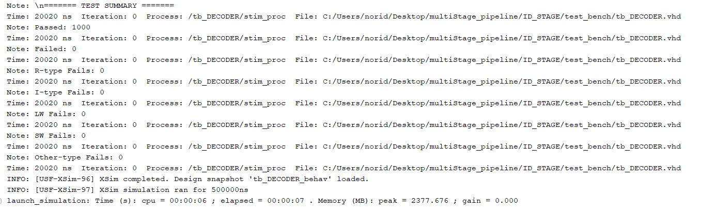
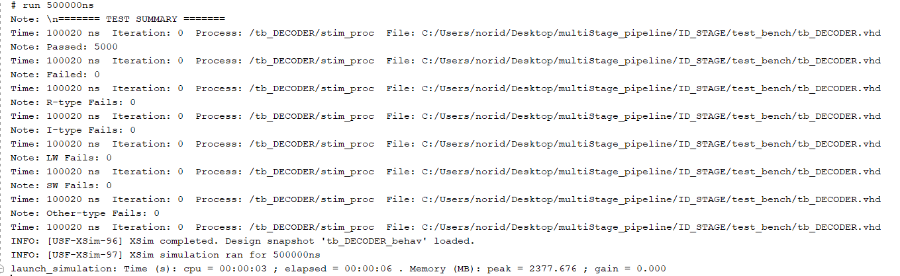
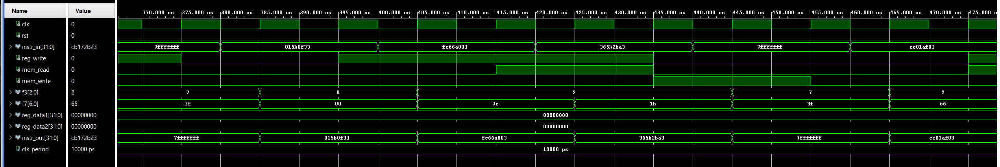

# ID_STAGE

## Overview
This module implements the Instruction Decode (ID) stage of a pipelined CPU. It handles instruction parsing, register file access, and generates control signals for downstream stages. Designed in VHDL for educational purposes.

## Features
- Decodes R-type, I-type, and load/store instructions.
- Extracts opcode, funct3, funct7, rs1, rs2, and rd fields.
- Generates control signals (`reg_write`, `mem_read`, `mem_write`).
- Accesses register file to output `reg_data1` and `reg_data2`.
- Ignores writes to register x0 as per RISC-V convention.

## Project Structure
ID_STAGE/
- images/
    - tcl_1000cases.png
    - tcl_5000cases.png
    - wave_1000cases.png
    - wave_5000cases.png
- src/
    - DECODER.vhd
- test_benches/
    - tb_DECODER.vhd
- .gitignore/
- README.md/

## Testbench Strategy
The testbench also tracks the pass/fail status of edge cases and non-standard instruction formats. These are included in the total test count to ensure they are not silently skipped.
This approach guarantees that even "other" or secondary cases are verified and contribute to the overall test integrity.

## Key Learnings
- Understood the timing of control signal generation during decoding.
- Learned to extract instruction fields using bit slicing.
- Differentiated between registered (clocked) vs combinational signals.
- Gained experience writing clean, modular VHDL for pipelined CPUs.

## Simulation Results
### Tcl Console Output
  
  

### Waveform Example
- These waveform examples show that `reg_write`, `mem_read`, and `mem_write` update on the rising edge of the clock.  
- The `f3` field is also correctly extracted based on the instruction input.

  
  
*Waveform showing `instr_in`, `reg_write`, `mem_read`, `mem_write`, `f3`, and register outputs.*

## How to Run
1. Launch **Vivado 2019** or newer
2. Open the project or create a new one and add the src and a test bench file.
3.  Set `tb_DECODER.vhd` as the top-level simulation unit.
4. Run the simulation:
    - Go to Flow → Run Simulation → Run Behavioral Simulation
    - Or use the project manager's simulation shortcut.
    - Increase the simulation runtime if needed to capture full behavior.
5. View signals in the Waveform Viewer and test status in the Tcl Console.

## Author
**Noridel Herron** (@MIZZOU)  
Senior in Computer Engineering  
noridel.herron@gmail.com

## Contributing
This is a personal academic project. Suggestions, issues, and improvements are welcome through GitHub.

## License
MIT License

## Disclaimer
This project is developed solely for educational and personal learning purposes.  
It may contain unfinished or experimental features and is not intended for commercial or production use.
